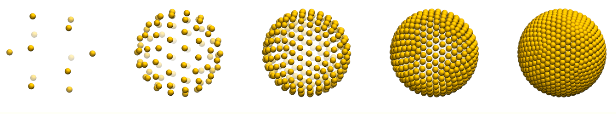

-----------------
Input files
-----------------

**Coordinate files:** ``conf1.xyz`` **and** ``conf2.xyz`` 

Standard ``.xyz`` files containing the cartesian coordinates of both structures. For the water
dimer, a dummy site (X) corresponding to water center of mass used to define the rotation axis
of MOL1

.. code-block:: none

   4
   Comment
   O    0.00000  0.06682 0.00000
   H   -0.76677 -0.53032 0.00000
   H    0.76677 -0.53032 0.00000
   X    0.00000  0.00000 0.00000 
    

**Run control file:** ``INPUT``

Plain text file containing detailed instructions prior to calculation. It must contain the 
following keywords, in any order (the ``:`` symbol is the separator):

.. code-block:: none

   rot1_factor :

Parameter (*p*) used to generate the spherical grid used for reorientation moves. The number
of points (*n*) obtained along the sphere surface by dodecahedron tessellation (as shown in
Figure 1) is given by ``n = 12 + 10 x 3 x (p-1) + 10 x (p-2) x (p-1)``. If onow uses ``p = 0``,
the reorientation move will then correspond to align molecule 2 along Z-axis (1 reorientational
move).

.. code-block:: none

   translation_factor :

Same as ``rot1_factor`` if a spherical translation shell is used (``shell <radius>``). 

.. code-block:: none

   rot2_factor :

Corresponds to the number of rotation moves around the rotation axis of MOL2.

.. code-block:: none

   rot2_range :

Corresponds to the maximum rotation angle (in degrees) around the rotation axis of MOL2.

.. code-block:: none

   temperature :

Absolute temperature (in K) used to calculate all thermodynamic properties ans probabilities.

.. code-block:: none

   potential :

Potential energy function selection. Current options are ``none``, ``lj-coul`` and ``bh-coul``.

.. code-block:: none

   write_frames :

Selects the format in which all valid frames will be written: ``XYZ``, ``MOP`` and ``none``. If
``MOP`` is selected, the optional character variable containing the first line of *MOPAC* input
(``mopac_job``) is read.

.. code-block:: none

   ref_mol1

Site of molecule 1 used for centering, according to ``conf1.xyz`` file.

.. code-block:: none

   rot_ref_mol1 :

Site of molecule 1 that will build its rotation vector, according to ``conf1.xyz`` file.

.. code-block:: none

   ref_mol2 :

Site of molecule 2 used for centering, according to ``conf2.xyz`` file. 

.. code-block:: none

   rot_ref_mol2 :

Site of molecule 2 that will build its rotation vector, according to ``conf2.xyz`` file.

.. code-block:: none

   shortest_distance :

Corresponds to the lowest intermolecular distance to consider the configuration as a valid one.
Below such value (in Angstrom) molecular contacts are considered strongly repulsive and an interaction
energy value of 10^10 kJ/mol is attributed to such configuration. This is useful to avoid
spending time calculating energies for unphisical configurations since the energy loop is skipped.

.. code-block:: none

   write_xtc :

